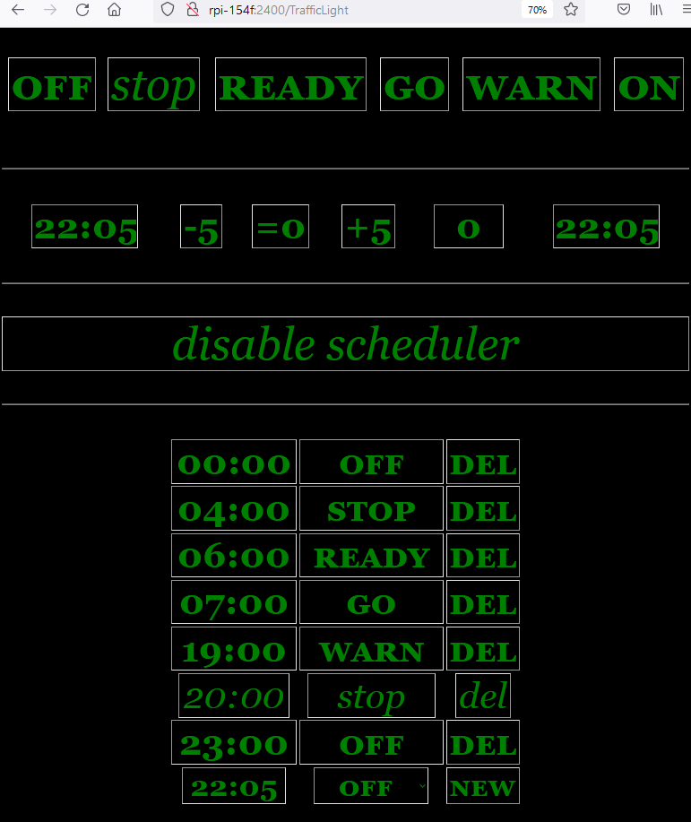

# TimedTrafficLight
Raspi based Traffic light indicating the bed-time for the kids.
This project fetures a timer based, european semaphore system. e.g.

- at 19:00 - yellow only (warn): time to prepare for bed
- at 20:00 - red only (stop): bed time
- at 06:00 - red and yellow (ready): wake up time
- at 07:00 - green (go): allowed to leave the bed
- turn off any led between  23 and 4



additionally, you can fast-forward of postopone the schedule.

### requirements
any Raspberry Pi should work. Required are three leds, green (pin37/BCM 26), yellow (pin35/BCM 19) and green (pin 33/BCM 13).
  

### installation    
```bash
# install dependencies
sudo apt-get update
sudo apt-get install -y python3-pip git
sudo pip3 install flask yattag simplejson sortedcontainers

# clone this project
git clone https://github.com/maldex/TimedTrafficLight.git

# ensure service will be started at bootup
sudo  systemctl enable --now ${PWD}/TimedTrafficLight/TimedTrafficLight.service
sudo systemctl daemon-reload
```
access the web-fontend via _http://<ip>:2400_